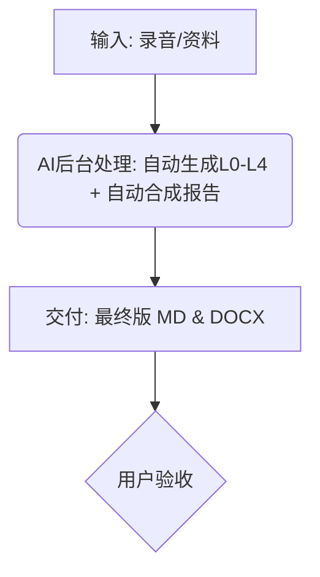

# IP案例生成流程规范

**版本**: 2.1

| 版本 | 日期 | 修改人 | 备注 |
| :--- | :--- | :--- | :--- |
| 2.1 | 2026-02-13 | @AI | 再次简化流程，移除中间文档的人工审核环节，实现从录音到最终报告的“一键直出”。 |
| 2.0 | 2026-02-13 | @AI | 简化为“分析”与“合成”两步。 |
| 1.0 | 2026-02-13 | @AI | 初始版本。 |

### 零、核心理念
本规范定义了**“一键直出”**的标准作业模式：AI 接收**客户访谈录音**后，在后台自动完成 **L0-L4 分析**，并立即将其合成为遵循官方模板的**IP案例分析报告**，最终直接交付 Word 文档。

**核心目标**：最大化效率，用户只需关注最终交付结果，无需介入中间分析过程。

### 工作流输入
- **核心输入**: 客户访谈录音文件、会议纪要。

### 工作流输出
- **最终交付物**: 
    1.  `[IP名称] IP案例分析报告-标准版.md`
    2.  `[IP名称] IP案例分析报告-标准版.docx`
- **中间产物 (自动归档)**: `Process/L0-L4` 目录下的中间分析文档（作为AI的思考底稿保留，供追溯使用）。

---

### 一、标准工作流概览

---

### 二、分步工作流详解

#### **STEP 1: 全自动处理 (分析+合成+转换)**
- **输入**: 
    - 客户访谈录音、会议纪要。
- **AI 内部执行动作 (连续执行，无需中断)**:
    1.  **L0-L4 分析 (后台)**: 
        - 依据 `Process/L0-L4` 规范，自动分析录音，生成全套中间文档（事实底座、方向提案、转化蓝图、执行闭环）。
        - *注：这些文档将自动保存在文件夹中，作为逻辑支撑，但不需要用户即时审核。*
    2.  **报告合成 (后台)**:
        - 立即读取生成的 L0-L4 文档。
        - 将核心结论抽取并“注入”到 `Process-IP案例/IP案例模板.md` 中。
    3.  **格式转换 (后台)**:
        - 调用 `pandoc` 将合成好的 Markdown 报告转换为 Word 文档。
- **产出**:
    - `[IP名称] IP案例分析报告-标准版.docx`
    - `[IP名称] IP案例分析报告-标准版.md`
    - (附带生成的 L0-L4 中间文件)

---

#### **STEP 2: 用户验收与交付**
- **动作**: 
    - 用户直接查看最终的 Word 文档。
    - 如果对结果满意 -> **流程结束**。
    - 如果需要修改 -> **进入变更流程**。

---

### 三、变更管理的黄金法则

**用户仅需对最终结果提出修改意见，AI 负责处理底层的逻辑一致性。**

- **场景: 用户对最终报告提出修改意见**
  - **用户动作**: 直接指出报告中的问题（例如：“这个购买理由不够有吸引力”）。
  - **AI 动作**: 
    1.  回溯修改对应的 `L2-方向提案` 中间文档。
    2.  自动重新触发合成与转换流程。
    3.  交付新的 Word 文档。
