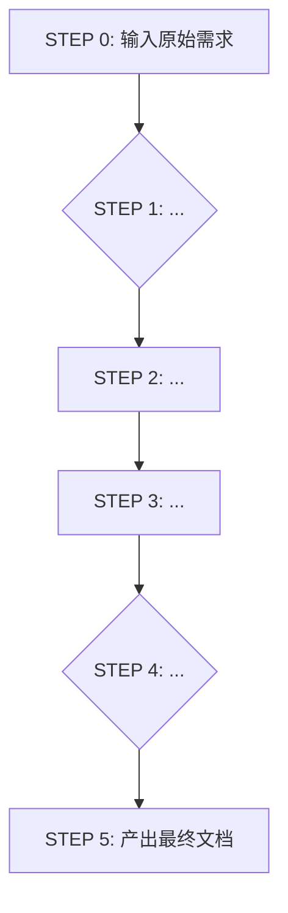

# [业务域] - 业务流程设计工作流

**版本**: [版本号]
**维护者**: @[负责人]
**最后更新**: YYYY-MM-DD

---

## 零、工作流概要

### 1. 核心理念
> [!NOTE]
> 简述本工作流的核心目标和设计理念。例如：将模糊的业务需求，系统性地转化为清晰、可执行的流程框架。

### 2. 工作流输入 (Upstream Inputs)
- **输入类型**: [描述输入信息的性质，例如：非结构化的业务需求文档、会议纪要、产品思考草稿等]
- **输入示例**: `@[路径/到/示例输入文件.md]`
- **输入要求**: [对输入信息的基本要求，例如：需要包含基本的用户故事或业务目标]

### 3. 工作流输出 (Downstream Outputs)
- **核心产出物**: [描述本工作流最终生成的一套文档。例如：L1-L3全套SOP文档]
- **输出物清单**:
    - `[业务域] L1 - 业务场景.md`
    - `[业务域] L2 - 核心元数据定义.md`
    - `[业务域].json`
    - `[业务域] L2 - 流程架构.md`
    - `L3 - [流程1].md`, `L3 - [流程2].md`, ...
- **产出物位置**: `@[路径/到/产出文件夹]`

---

## 一、标准工作流概览

> [!TIP]
> 使用Mermaid图表，可视化地展示工作流的节点和流转关系。

---

## 二、分步工作流详解

### **STEP 0: [节点0名称]**
- **输入**: [说明节点的输入]
- **动作**: [描述节点的核心处理活动]
- **引用规范/模板**:
    - `@[路径/到/规范.md]`
    - `@[路径/到/模板.md]`
- **产出**: [说明节点的输出]
- **CHECKPOINT**: [定义节点的检查点或需要人工确认的事项]

---

### **STEP 1: [节点1名称]**
- **前置条件**: [完成STEP 0]
- **输入**: ...
- **动作**: ...
- **引用规范/模板**: ...
- **产出**: ...
- **CHECKPOINT**: ...

---

## 三、变更管理的黄金法则

> [!WARNING]
> 定义对上游文档进行修改时，必须遵循的下游文档连锁更新规则，以维护整个文档体系的一致性。

- **场景1: 修改 `[上游文档A]`**
  - **触发**: 如果 `[文档A的某个部分]` 发生改变...
  - **连锁反应**:
    1. **必须** 同步更新 `[下游文档B]`。
    2. **可能** 需要修改 `[下游文档C]`。
    3. **必须** 通知相关人员此变更。 