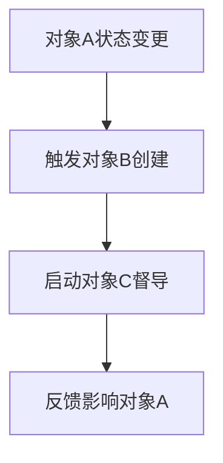

# [业务域名称] L2 - 流程架构

**版本**: 1.0

| 版本 | 日期       | 修改人 | 备注     |
| :--- | :--- | :--- | :--- |
| V1.0 | YYYY-MM-DD | [姓名] | 初始版本 |

---

## 流程架构总览
*本文档是 L2-对象与角色定义 和 L3-SOP文档 之间的桥梁，它将业务对象的状态演变映射为具体的流程架构。*
> [!IMPORTANT]
> **设计原则**: 优先围绕少数核心`状态变量`对象的生命周期来构建流程。辅助性的、由任务驱动的活动应内聚到主流程的SOP中，避免创建过多独立的SOP。

## 涉及对象概览
| 对象名称 | 对象类型 | 核心属性 | 主要状态流转 | 负责角色 |
| :--- | :--- | :--- | :--- | :--- |
| `[核心状态变量对象A]` | 状态变量 | `短期` | `[状态A] -> [状态B] -> [状态C]` | `[角色A]` |
| `[核心状态变量对象B]` | 状态变量 | `短期` | `[状态A] -> [状态B]` | `[角色B]` |

## 流程总览表
> [!TIP]
> **聚合原则**: 审视以下流程，若发现多个流程可被一个更宏观的概念涵盖（如多个“检查”类流程），应考虑将它们合并为一个SOP，并将原流程名降级为L4标题。

| L3 - 流程名称 | 流程含义 | 核心驱动对象 | 触发条件 | 主导角色 | 关联对象 |
| :--- | :--- | :--- | :--- | :--- | :--- |
| **[流程编号] [流程名称]** | [流程的业务价值和目标] | `[核心对象]` | [具体的状态变更条件] | `[主导角色]` | `[对象A]`, `[对象B]` |

---

## 一、[核心状态变量对象A] - 流程架构

### **对象驱动的流程设计**
- **核心状态流转**: `[状态A]` -> `[状态B]` -> `[状态C]`
- **关键里程碑**: 每个状态代表的业务含义
- **决策点**: 状态变更的判断标准

### **相关L3流程**
| 流程名称 | 状态变更 | 触发条件 | 主要产出 |
| :--- | :--- | :--- | :--- |
| `[流程1]` | `[状态A] -> [状态B]` | [具体触发条件] | [主要产出对象] |
| `[流程2]` | `[状态B] -> [状态C]` | [具体触发条件] | [主要产出对象] |

### **字段演进规律**
- **[状态A]阶段**: 主要填写字段 `[字段1]`, `[字段2]`
- **[状态B]阶段**: 新增字段 `[字段3]`, 更新字段 `[字段1]`
- **[状态C]阶段**: 完善字段 `[字段4]`, 锁定字段 `[字段2]`

### **角色参与模式**
- **`[角色A]`**: 负责 `[状态A] -> [状态B]` 的推进
- **`[角色B]`**: 负责 `[状态B] -> [状态C]` 的推进
- **`[角色C]`**: 负责全程督导和质量控制

---

## 二、[对象B名称] - 流程架构

### **任务对象特性**
- **生命周期**: `提出 -> 排期 -> 执行 -> 验收`
- **触发来源**: 由 `[对象A]` 状态变更触发创建
- **完成标准**: [具体的完成和验收标准]

### **相关L3流程**
| 流程名称 | 任务阶段 | 执行角色 | 关联对象状态 |
| :--- | :--- | :--- | :--- |
| `[流程3]` | 任务创建与排期 | `[角色C]` | `[对象A]` 处于 `[状态B]` |
| `[流程4]` | 任务执行与验收 | `[角色D]` | `[对象A]` 处于 `[状态B/C]` |

### **任务分类体系**
- **按紧急程度**: 紧急任务 / 常规任务 / 延期任务
- **按复杂度**: 简单任务 / 复杂任务 / 项目级任务
- **按执行方式**: 个人任务 / 团队任务 / 跨组任务

### **质量控制机制**
- **过程控制**: 执行过程中的检查点设置
- **结果验收**: 任务完成后的验收标准
- **问题处理**: 任务异常时的处理流程

---

## 三、[对象C名称] - 流程架构

### **督导对象特性**
- **督导频率**: [根据被督导对象状态确定频率]
- **督导维度**: [督导检查的具体维度]
- **督导结果**: [督导评级和改进建议]

### **相关L3流程**
| 流程名称 | 督导时机 | 督导角色 | 被督导对象 |
| :--- | :--- | :--- | :--- |
| `[流程5]` | 定期督导 | `[督导角色]` | `[对象A]`, `[对象B]` |
| `[流程6]` | 问题督导 | `[督导角色]` | 特定问题对象 |

### **督导数据流**
- **数据收集**: 从各业务对象收集督导所需数据
- **评估计算**: 基于收集数据进行督导评级计算
- **结果反馈**: 督导结果向相关角色的反馈机制

---

## 四、跨对象协调流程

### **对象间联动关系**

### **数据一致性保障**
- **同步更新机制**: 一个对象变更时，相关对象的自动同步
- **一致性检查**: 定期检查对象间数据的一致性
- **冲突解决**: 数据冲突时的处理规则

### **异常处理流程**
- **常见异常类型**: [列出可能的异常情况]
- **异常检测机制**: [如何及时发现异常]
- **异常处理预案**: [不同异常的处理方法]

---

## 流程优化建议

### **效率提升点**
- **自动化机会**: 可以自动化处理的环节
- **并行处理**: 可以并行执行的流程环节
- **瓶颈识别**: 容易产生瓶颈的关键环节

### **质量改进点**
- **质量控制强化**: 需要加强质量控制的环节
- **标准化需求**: 需要进一步标准化的操作
- **培训重点**: 执行人员需要重点培训的内容

---

**流程架构维护说明**:
- **更新频率**: 对象定义变更时同步更新
- **责任人**: `[业务架构师]`
- **审核人**: `[业务负责人]` 